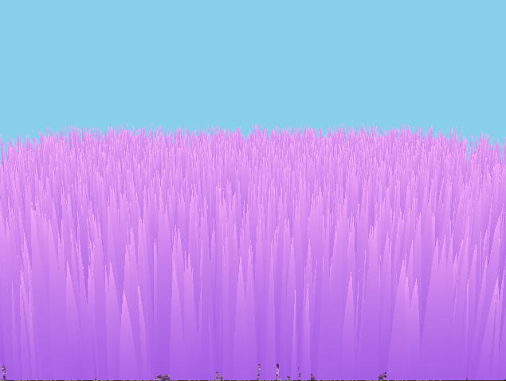
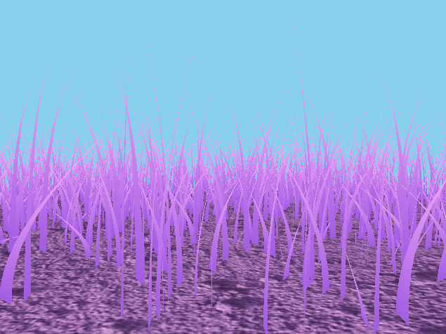
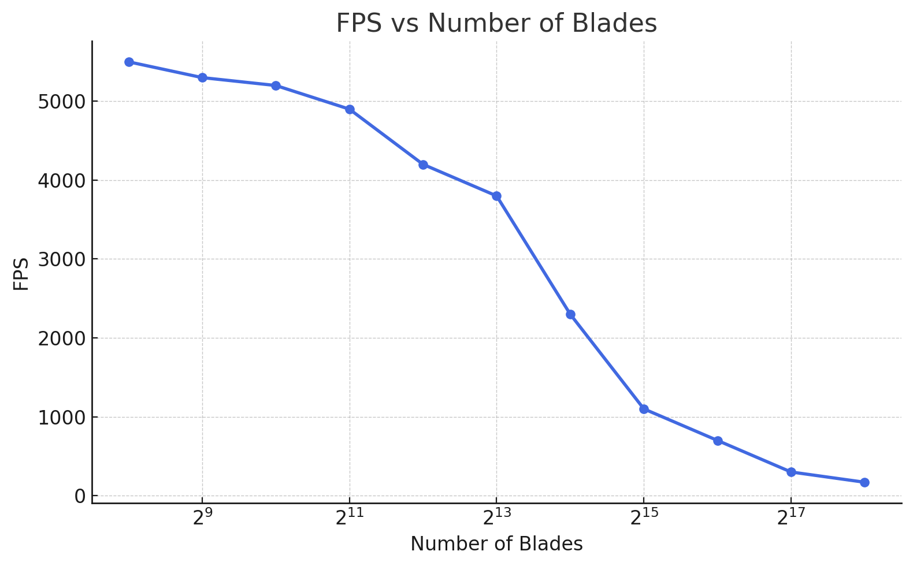
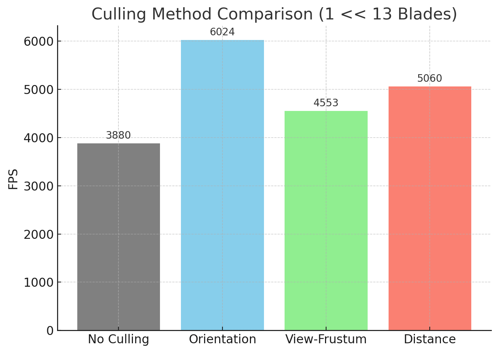

Vulkan Grass Rendering
==================================

**University of Pennsylvania, CIS 565: GPU Programming and Architecture, Project 5**

* Sirui Zhu
* Tested on: Windows 11, i7-13620H, RTX 4060 (Personal)

	

## Overview
Real-time grass in Vulkan: blades are Bezier curves simulated in a compute pass, then tessellated and shaded. Includes wind/gravity/recovery forces, distance-based LOD, and a controllable sphere that pushes grass aside.

## Implemented Features
- Basic Render without physics: 
	

		
	

	- Baseline pipeline to render the plane and blades without applying forces, validating geometry, tessellation, and shading paths.
	- Representing Grass as Bezier Curves: Each blade uses v0/v1/v2 + up; orientation/height/width/stiffness are packed in the .w components per the project spec.
	- Blade shape (tessellated quad ribbon): Quad patch forms a ribbon; width tapers as `w(v) = width * (1 - v^2)` so the tip appears triangular. Vertical tessellation uses LOD 10/5/2 (near/mid/far); horizontal kept at 1 for thin blades.
	

		
	

- Simulating forces: Implemented in the compute shader to update v2 and keep blades stable.
  - Gravity: Environmental gravity plus a front-gravity term derived from blade orientation; contributes to bending at the tip (v2).
  - Recovery: Hooke’s law recovery pulls v2 toward its initial upright position; stiffness controls how strongly it snaps back.
  - Wind: Time-varying, noise-modulated wind direction and gusts; aligned with blade facing to amplify believable sway.
    - Noise source: position-based simplex noise sampled on v0.xz and animated over total time to produce spatially coherent, non-repeating motion across the field.
    - Wave-like motion: a low-frequency sine wave is blended with the noise (phase and amplitude modulated by noise), so nearby blades sway together while still having subtle per-blade variation.
    - Direction + strength: the noise/wave set a wind angle (cos/sin) and a time-varying gust factor; the final wind force scales with gusts and is reduced near the root using a height ratio.
  - Total force: Forces integrated to update v2, projected above ground, then v1 is recomputed to preserve blade length/curvature.
- Culling:
	- Orientation:
		

			
		

		- Removes blades nearly edge-on to the camera to avoid sub-pixel aliasing. Cull if `abs(dot(viewDir, f)) < 0.9`.
		- Toggle `ORIENTATION_CULLING` (1 on, 0 off) in compute.comp

	- View-frustum:
		

			
		

		- Clip-space tests for v0, v2, and an approximate midpoint with tolerance to conservatively cull off-screen blades. Cull if all of v0, v2, and m are outside x/y bounds `[-(w+TOLERANCE), +(w+TOLERANCE)]` in clip space.
		- Toggle `VIEW_FRUSTUM_CULLING` (1 on, 0 off) in compute.comp

	- Distance:
		

			
		

		- Bucketed distance culling reduces blade density with range using `NUM_BUCKETS` and `MAX_DISTANCE`. Cull when `index % NUM_BUCKETS < NUM_BUCKETS * (d_proj / MAX_DISTANCE)`, where `d_proj = length((v0 - camPos) - up * dot(v0 - camPos, up))`.
		- Toggle `DISTANCE_CULLING` (1 on, 0 off) in compute.comp
    
- Extra credit: LOD: 
	

		
	

	- Tessellation levels adapt by camera distance (near/mid/far ≈ 10/5/2) to save work while keeping nearby detail.
	- Along blade height (vertical): high subdivision uses 10/5/2 to capture curvature where it matters visually.
	- Across blade width (horizontal): kept at 1.0 (no subdivision) since blades are thin; prioritizes performance over negligible width detail.

- Extra credit: interactive sphere
	

		
	

	- A movable sphere repels nearby blades in compute; sphere position/radius are passed as a uniform.
	- Set ADD_INTERACTIVE_SPHERE (1 on, 0 off) in main.cpp

## Performance Analysis

### Impact of Blade Count on FPS

	

Summary (2^8 → 2^18 blades):

- 2^8–2^12: FPS is relatively flat and very high — fixed per‑frame overhead dominates; compute/tessellation are under‑utilized and per‑blade SSBO traffic is negligible.

- 2^13–2^15: Steady decline begins — compute (force integration, noise, sphere interaction, culling) and tessellation control/eval become primary costs; cache locality remains good so the slope is moderate.

- 2^16–2^18: Compute/memory bound — SSBO reads/writes and patch processing saturate occupancy/bandwidth; frame time grows ~ linearly with blade count (FPS ≈ 1/(a + b·N)), so doubling blades roughly doubles frame time.

- What helps most: Do culling in compute (orientation + frustum + distance) to avoid feeding the graphics pipeline, and reduce vertical tessellation with distance (bucket LOD). Keeping SSBO access coherent further reduces the high‑N slope.

### Impact of Culling on FPS

	

- Without culling: The GPU simulates, tessellates, and shades all blades in view space. Cost scales with total N, so FPS drops quickly as density grows.
	- Cost composition: compute O(N) (forces, noise, sphere), tessellation O(N·tess_vertical) with geometry amplification, and raster cost ∝ covered pixels.
	- Amplification: far/edge-on blades still incur tessellation and fragment work that contribute little visually.

- Orientation culling: Discards blades whose normals are nearly parallel to the camera’s view direction. The benefit is minor in most cases but noticeable at grazing angles, where many ribbons would otherwise overlap and alias.
	- Criterion: abs(dot(viewDir, f)) < T (e.g., T≈0.9) in compute; cheap dot+abs+compare, can be done branch‑light and recorded as a mask.
	- Effect: avoids sub‑pixel ribbon aliasing and saves tessellation on nearly invisible blades; strongest when the camera yaw aligns with blade facing.
	- Tuning: higher T removes more aliasing but hides more geometry; conservative values minimize popping.

- View‑frustum culling: Rejects blades entirely outside the camera frustum early in the compute pass. This gives a strong FPS boost when large areas lie outside the FOV, avoiding unnecessary tessellation and rasterization.
	- Method: clip‑space tests for v0, v2, and a midpoint with tolerance (conservative accept) to avoid false negatives.
	- Cost: a few matrix multiplies + compares per blade; easily offset by avoiding downstream tessellation/fragment work.
	- Coherence: early rejects keep warps coherent and reduce divergence in later stages.

- Distance culling: Reduces far‑field density with bucketed thresholds. This typically provides the largest, most consistent improvement in open scenes, since distant blades contribute least but are most numerous.
	- Scheme: index % NUM_BUCKETS < NUM_BUCKETS * (d_proj / MAX_DISTANCE); density falls roughly linearly with projected distance.
	- Distribution: deterministic predicate keeps visual uniformity; adding a hash per blade can blue‑noise the pattern to hide banding.
	- Synergy: pair with distance‑based tessellation (lower vertical levels) for compounding savings.
